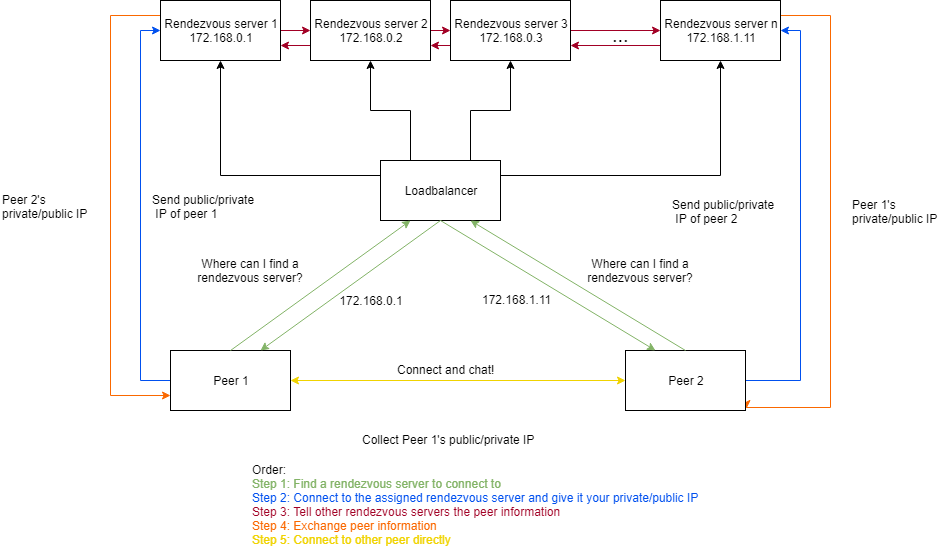

## Chatty

Chatty is a peer to peer chat application that is backed by a high availability rendezvous server. Utilizing quic for peer to peer connections, this application provides blazing fast speeds.

### Implementation
The implementation of this application was separated into three parts, for the sake of clarity, each of the parts will be described in detail separately. Below is a high level design of the application.

#### LoadBalancer

The loadbalancer for the Chatty application is quite simple, although it is called a loadbalancer it does not work in the way that a normal loadbalancer might work. Instead of forwarding requests to the servers, it simply tells the peers the IP of a rendezvous server they can hit. It uses a basic round robin algorithm to determine which server to route to. The reason why routing connections would not work is because the peers need to connect to the rendezvous server using UDP so that their public IP address does not change when they go to preform the UDP holepunching. There is no established way to route UDP traffic because it is connectionless. The alternative solution to provide an endpoint for peers to hit to collect server IP's is done through GRPC. GRPC allows the loadbalancer to listen on a specific endpoint and respond to rest-like API calls from clients. From the client point of view, they are essentially making a new GRPC object and simply calling functions on that object. All that the loadbalancer is responsible for is keeping track of which rendezvous servers are available. Each server is required to register with the loadbalancer before it starts serving requests and health checks are performed every 5 seconds by the loadbalancer on registered servers.  

Although it may appear as though by having this loadbalancer in front of several servers, the single point of failure has simply moved from the server to the loadbalancer this isn't exactly true. First off, any number of load balancers can be added to the system, the only thing that is required is that each of the servers registers with each of the loadbalancers so they are aware of the servers. Secondly, the loadbalancer is greatly simplified from the rendezvous server which means significantly less bandwidth is required, ultimately putting less stress on the loadbalancer and reducing the chance it would fail.

#### Rendezvous Servers

The rendezvous servers have one main purpose, to exchange information between peers. In order to achieve this however, they are required to interact with not only the peers, but the loadbalancer and other servers. Once a new server registers with a loadbalancer it is given a list of other live servers. In addition, when a new server registers, all of the existing servers are notified of its arrival. When a server fails to respond to a healthcheck, the loadbalancer removes it from the list of available servers and notifies the healthy servers. In order to avoid overwhelming the loadbalancer, on server arrival and removal, the loadbalancer randomly chooses a healthy server and tells it to notify all the other servers of of the update. Once a server receives a request from a peer with their private ip, name and friend name the server notes the public ip that was used in the connection and notifies all other servers of the peer arrival. All server-server and server-loadbalancer communication is done using GRPC which allows for a defined set of fields and functions to be implemented.

The peer information is stored in a hash table on each server that is replicated across all servers. Replication was chosen over a generic DHT becausecurrent DHT implementations provide a O(logn) lookup time while a replicated hash table would provide an O(1) lookup time. The O(1) lookup time would also mean a slower write time O(n), however it was decided that the only time a peer needs a quick response is when the other peer is already connected and waiting. In this case, the server that the second peer connected to would already have the other peer information and it could return in O(1) time. In addition, from the point of view of a peer, they do not care how long it takes the servers behind the scenes to update all the nodes.  

The second part of the rendezvous servers deals with the actual server-peer connection. Unlike all other connections, server-peer connection is done using the quic protocol. Quic is a transport layer protocol that sits on top of UDP and provides the reliability of TCP, the security of tls and the speed of UDP. The reason why quic was used(other than the mentioned benefits) is that the peers are required to use UDP to communicate with each other. Once a server has received a request from a peer it will hold the connection until the other peer has connected to the same or possibly different server. In order to avoid losing any connections, each of the individual servers is responsible for noticing the friend peer in the replicated hash table and sending the other peers information on the long lasting connection.

An alternative approach to UDP/Quic would be to use TCP. The problem with using TCP in such a high level language like golang is that it does not allow for a listener/server to also send packets out. This means TCP holepunching would not work because one side would never be making an entry in its table because it could only listen. This could be resolved by setting the kernel level SO_REUSEPORT so that two tcp connections could listen on the same port, one for sending and one for receiving packets [4]. The benefits of quic and the built in connectionless features of UDP made this a no brainer choice for quic instead of TCP.

#### Peer Connection

The peers first make a GRPC call to the loadbalancer to get a server IP. They then connect to the server and send their private ip, name and friend name, while at the same time waiting for a response back from the server with the other peers information. Once both peers have received information from the server they will begin connection establishment. The peers first try to punch a hole through eachothers NAT in order to connect to each other via public IP address.

One of the big problems with peer to peer connections is dealing with the NAT within the router. There is several different types of NATs, some more restrictive than others. For example one of the most common types of NATs is the full cone NAT, which only requires that the intended outgoing public ip has a corresponding private ip entry within the table [6]. An alternative solution to this is a symmetric NAT that has separate entries for each {private ip host, public ip destination} pair, meaning if a peer connected to the server it might have a different NAT entry than if it connected to another peer [6]. In addition, the peer has essentially no control over what public IP address it gets, it may change depending on who it is trying to talk to, all of this is decided by the NAT [6]. In order to minimize the chances that the NAT alters the public IP for each separate connection, the quic library in golang allows a single udp server to be passed into the quic server initialization. This means the same UDP server under the hood can be used for peer info exchange, hole punching and peer communication. In almost all testing cases, the use of the same private IP was sufficient to ensure the same public IP was used by the router.

If the peers fail to receive each others UDP packets after a predefined amount of time, they will attempt to connect to each other locally using their private ip's. If this does not work either then there is likely some problems occurring related to either their NAT or the network they are within. It is common for large networks such as those within schools, apartments, offices etc to prevent devices from connecting directly to each other within the network. This technique is know as access point(AP) isolation and stops devices from being able to see each other on the network or connect to each other via private IP. If this is the case, there is essentially nothing that can be done to establish a connection between peers. An alternative solution would be to route traffic through the server if this happens, however that somewhat defeats the purpose of the application. The figure below shows the peer to peer connection establishment process.

